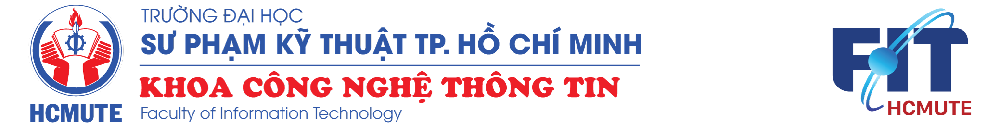
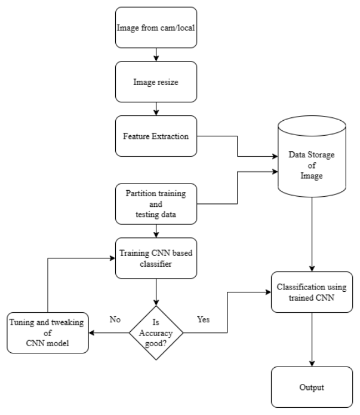
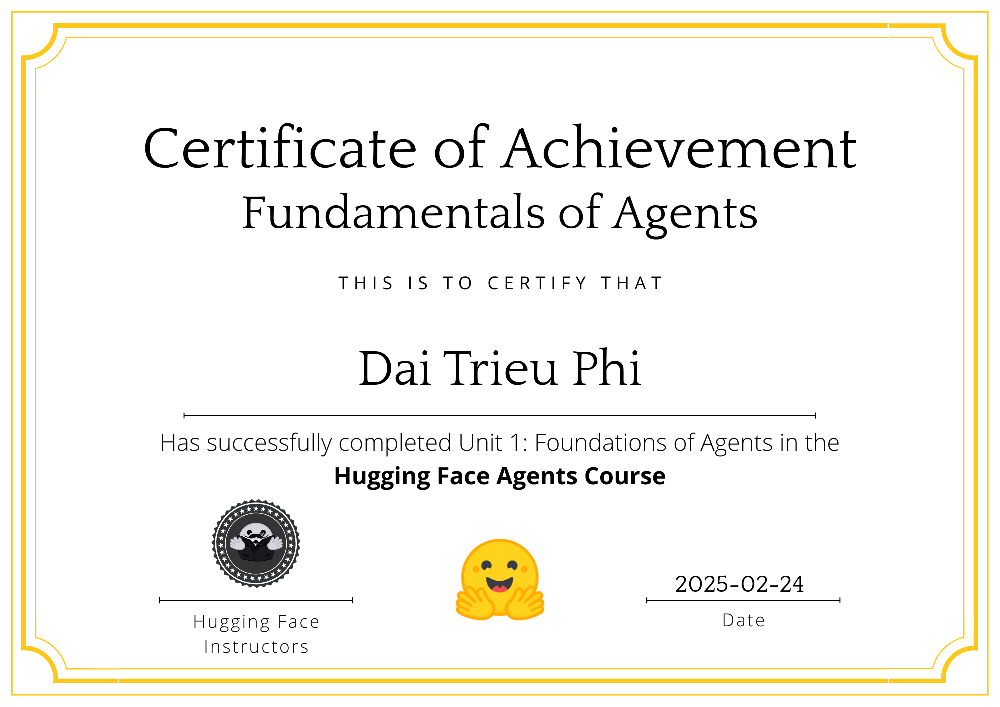

  

    <h1 style="margin-top: 0;"> Về tôi</h1>
    <!-- Thêm style="text-align: justify;" vào thẻ p -->
    

      Xin chào! Tôi là Đái Triệu Phi (Dai Trieu Phi), đang trong hành trình trở thành một AI Engineer, với niềm đam mê mãnh liệt trong lĩnh vực Machine Learning và Deep Learning, đặc biệt là Computer Vision. Blog này là nơi tôi chia sẻ kiến thức, kinh nghiệm, các dự án AI và hành trình học tập của mình.
      Với nền tảng vững chắc về Computer Science và sự tò mò không ngừng về công nghệ, tôi luôn tin rằng AI không chỉ là một công cụ mà còn là chìa khóa để giải quyết những thách thức phức tạp trong thế giới thực, tạo ra những giải pháp giá trị và vượt qua các rào cản công nghệ.
    

  

  

    <!-- Keep your profile image path -->
    
  

## 🎓 Học vấn (Education)

<!-- Keep your university logo path -->

**Đại Học Sư Phạm Kỹ Thuật TP.HCM (Ho Chi Minh City University of Technology and Education)** (2021 - 2025)

- Chuyên ngành: Computer Science (Chuyên sâu AI/ML)
- GPA: 8.01/10
- Đồ án tốt nghiệp (Dự kiến): "Mô hình tạo sinh mô tả hình ảnh kết hợp quy trình MLOps để hỗ trợ người khiếm thị nhận biết môi trường giao thông ở Việt Nam" (Aligned with personal projects)
- Các project nghiên cứu tiêu biểu: Vietnamese Sign Language Detection, Traffic Pictures Captioning Dataset

## 💼 Kinh nghiệm làm việc (Work Experience)

### 🏢 Hitachi Digital Services Vietnam (Hồ Chí Minh)

**IT Consulting & Implementation - Associate** (03/2025 - Hiện tại)

- Phân tích nhu cầu kinh doanh, tư vấn giải pháp CNTT và triển khai hệ thống công nghệ để tối ưu hóa hoạt động.
- Thành thạo cấu hình hệ thống, tích hợp phần mềm và cung cấp hỗ trợ kỹ thuật.
- Kỹ năng cộng tác hiệu quả với các nhóm chức năng chéo và giao tiếp với khách hàng để cung cấp các giải pháp CNTT hiệu quả.

**AI Engineer Intern** (07/2024 - 03/2025)

- Tham gia các dự án computer vision, chuyên sâu về deep learning.
- Thực hiện các tác vụ xử lý ảnh sử dụng OpenCV cho các ứng dụng thực tế.
- Xây dựng, huấn luyện và tối ưu hóa các mô hình deep learning để giải quyết các thách thức liên quan đến computer vision.
- Cộng tác hiệu quả trong môi trường năng động và đóng góp vào các giải pháp có tác động.
- **Tech stack (General):** Python, OpenCV, Deep Learning Frameworks (PyTorch/TensorFlow), SQL.

## 🚀 Các Dự án Nổi bật (Featured Projects)

### 1. Vietnamese Sign Language Detection - Computer Vision Project

<!-- Replace with actual demo image/gif if available -->
<!--  -->

**Mô tả:** Phát triển mô hình nhận dạng Ngôn ngữ Ký hiệu Việt Nam (VSL) sử dụng Computer Vision. Sử dụng thư viện MediaPipe để thu thập và trích xuất đặc trưng keypoints từ các khung hình ảnh, xây dựng bộ dữ liệu VSL tùy chỉnh. Huấn luyện mô hình Convolutional Neural Network (CNN) để phân loại các ký hiệu.

**Tech stack:**

- Language: Python
- Libraries: MediaPipe, OpenCV, Scikit-learn
- Model Architecture: CNN (Implemented with TensorFlow/Keras or PyTorch)
- Environment: Jupyter Notebook / Google Colab

**Kết quả:**

- Mô hình đạt độ chính xác **>90%** trên tập dữ liệu thử nghiệm.
- Có khả năng nhận dạng phần lớn các ký tự trong bộ dữ liệu VSL đã xây dựng.

[🔗 GitHub](https://github.com/TrieuPhi/VietNamese-Sign-Language-Detection-2024) | <!-- [🎥 Demo](link) | --> [📝 Blog Post](link)

### 2. Traffic Pictures Captioning Dataset - Data Curation Project

<!-- Replace with actual demo image/gif if available -->
<!--  -->

**Mô tả:** Xây dựng và quản lý một bộ dữ liệu gồm các hình ảnh cảnh giao thông đa dạng (giao lộ, đường cao tốc, đô thị, điều kiện thời tiết khác nhau) dành riêng cho nhiệm vụ Image Captioning. Mục tiêu là cung cấp tài nguyên để huấn luyện và đánh giá các mô hình tạo mô tả tự động cho hình ảnh liên quan đến giao thông, có tiềm năng ứng dụng trong hỗ trợ người khiếm thị, xe tự hành và hệ thống giao thông thông minh.

**Tech stack:**

- Data Collection & Processing: Python, Pandas
- Annotation Tools (Potential): LabelImg, CVAT, or custom scripts
- Storage: Local / Cloud / Kaggle Datasets

**Kết quả:**

- Bộ dữ liệu được công bố công khai trên Kaggle.
- Cung cấp nền tảng cho nghiên cứu và phát triển các mô hình Image Captioning tập trung vào lĩnh vực giao thông tại Việt Nam.

[🔗 Kaggle Dataset](https://www.kaggle.com/datasets/trieuphi/traffic-pictures-captioning/data) | <!-- [🎥 Demo](link) | --> [📝 Blog Post](link)

*(Other notable projects include Sakila DataWarehouse, Data Mining with Apache Hive, and Germini Captioning Dataset - See GitHub for more details)*

## 📜 Chứng chỉ & Thành tựu (Certificates & Achievements)

<!-- Keep your certificates image path -->

- **AI Agents Fundamentals** - Hugging Face (02/2025)
  - Skills: Understanding and building AI agents using modern tools and frameworks.
  - [🔗 Certificate](https://huggingface.co/datasets/agents-course/certificates/resolve/main/certificates/Phi2103/2025-02-24.png)

- **Google AI Essentials** - Coursera / Google (05/2024)
  - Skills: Foundational concepts of AI, machine learning, responsible AI practices.
  - [🔗 Certificate](https://www.coursera.org/account/accomplishments/verify/QIPOYOG4NYAP)

- **Fundamentals of Digital Image and Video Processing** - Coursera / Northwestern University (05/2024)
  - Skills: Image/video representation, filtering, enhancement, compression, segmentation.
  - [🔗 Certificate](https://coursera.org/share/9a2bcf9557f681e511262def184c14dc)

## 🛠️ Technical Skills

### AI/ML

- **Deep Learning:** PyTorch, TensorFlow, Keras
- **Computer Vision:** OpenCV, MediaPipe, CNNs, Object Detection (e.g., YOLO - learning), Image Processing
- **Machine Learning:** Scikit-learn, Regression, Classification (SVM, Trees, Forests), Clustering (K-Means), Model Evaluation, Feature Engineering
- **NLP (Interest Area):** exploring Transformers, BERT, GPT

### Programming & Data

- **Languages:** Python, SQL, R, Java, C#/C++, OOP Principles
- **Data Modeling:** Relational Databases (SQL Server), Dimensional Modeling (Kimball) 
- **EDA & Visualization:** Pandas, Matplotlib, Seaborn

### Tools & Platforms

- **Version Control:** Git, GitHub 
- **Environments:** Jupyter Notebook, Google Colab 

## 📫 Liên hệ & Social Media (Contact & Social Media)

- 🔗 **LinkedIn:** [linkedin.com/in/trieuphi](https://www.linkedin.com/in/trieuphi/)
- 🐙 **GitHub:** [github.com/TrieuPhi](https://github.com/TrieuPhi)
- 📧 **Email:** [dtptrieuphidtp@gmail.com](mailto:dtptrieuphidtp@gmail.com)
- 🌐 **Blog:** [trieuphi.github.io/Study/about](https://trieuphi.github.io/Study/about)
<!-- - 🐦 Twitter: [@username](https://twitter.com/username) -->

*(Last updated based on CV from March 2025)*