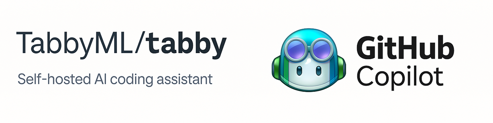
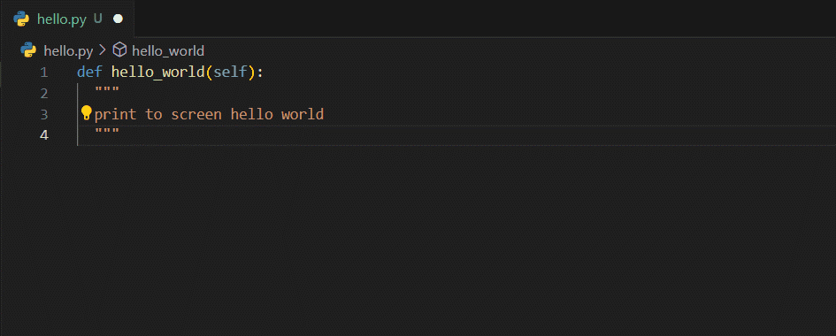
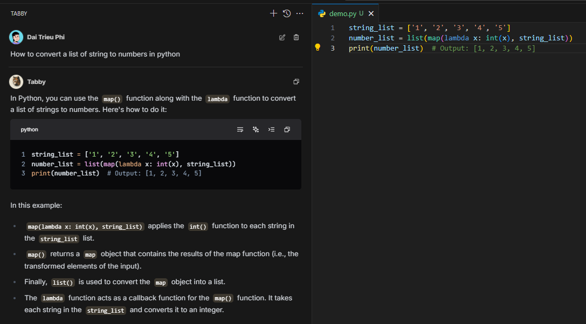
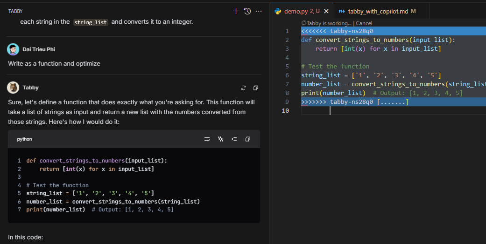

# Báo cáo: Demo Lợi ích Tabby (Local) 

**Người thực hiện:** A&I - Coder Assistant

**Ngày:** 2025-04-11

**Đối tượng Demo:** Quản lý Dự án, Đại diện các Team dự án tiềm năng.

Trình bày một cách trực quan và thuyết phục những lợi ích **khác biệt và cốt lõi** của việc sử dụng Coder Assistant chạy local (thông qua Ollama host model, Tabby làm client) so với giải pháp cloud như GitHub Copilot, tập trung vào các yếu tố quan trọng trong môi trường doanh nghiệp.

**Thông điệp chính cần truyền tải:**

"Giải pháp local này mang lại **sự kiểm soát và bảo mật dữ liệu tuyệt đối**, hoạt động **không cần internet**, và **tiềm năng tối ưu chi phí dài hạn** mà vẫn cung cấp khả năng hỗ trợ lập trình viên hiệu quả, dù có thể có những đánh đổi nhất định về tốc độ hoặc sự tiện lợi tức thì so với Copilot."

---

**Demo Chi tiết:**
> **1. Gợi ý Code (Completion):** Tự động hoàn thành code dựa trên ngữ cảnh, giúp tăng tốc độ lập trình.

> **2. Chat với Model Local:** Tương tác trực tiếp với mô hình AI chạy trên máy để hỏi đáp, giải thích code, hoặc sinh code mới mà không cần gửi dữ liệu ra ngoài.

> **3. Áp dụng Thay đổi Thông minh (Apply in Editor):** Xem trước và áp dụng các thay đổi do AI đề xuất trực tiếp trong trình soạn thảo, tương tự các AI IDE tiên tiến.

> **4. Hoạt động Offline Hoàn toàn:** Không yêu cầu kết nối internet, đảm bảo hoạt động liên tục và bảo mật trong mọi môi trường.

> **5. Hỗ trợ Đa Ngôn ngữ:** Cung cấp gợi ý cho nhiều ngôn ngữ lập trình phổ biến.

> **6. Tích hợp IDE Mượt mà:** Hoạt động như một phần mở rộng (extension) quen thuộc trong các IDE phổ biến như VS Code, JetBrains IDEs,....

> **7. Linh hoạt về Model:** Cho phép lựa chọn và chuyển đổi giữa các mô hình AI khác nhau (ví dụ: các model từ Ollama) để phù hợp với yêu cầu cụ thể hoặc phần cứng sẵn có.

> **8. Bảo mật Dữ liệu Tuyệt đối:** Toàn bộ quá trình xử lý và gợi ý diễn ra trên máy local hoặc hạ tầng nội bộ, đảm bảo mã nguồn không bao giờ rời khỏi tầm kiểm soát.

> ***Tabby còn hỗ trợ rất nhiều tiện ích và tính năng khác chưa được khám phá.***  
## So sánh Với Không Sử Dụng Coding Assistant

### Tác động đến Hiệu suất Phát triển

| Tiêu chí | Không có Coding Assistant | Với Coding Assistant (Tabby/Copilot) | Cải thiện |
|----------|--------------------------|----------------------------------|----------|
| **Thời gian code** | 100% (baseline) | Giảm 20-35% thời gian coding | **↓ 20-35%** |
| **Số dòng code/giờ** | 100% (baseline) | Tăng 30-50% số lượng code | **↑ 30-50%** |
| **Tốc độ hoàn thiện feature** | 100% (baseline) | Tăng 15-30% | **↑ 15-30%** |
| **Giảm context switching** | Thường xuyên rời IDE để tìm kiếm | Giảm 40-60% việc rời khỏi IDE | **↓ 40-60%** |
| **Thời gian tìm kiếm docs/references** | 100% (baseline) | Giảm 25-40% | **↓ 25-40%** |

*Lưu ý: Những đánh giá này chỉ mang tính chất tham khảo*
### Lợi ích 

- **Giảm mệt mỏi (cognitive load):**
  - Developer tập trung vào logic nghiệp vụ thay vì chi tiết triển khai
  - Giảm áp lực ghi nhớ cú pháp và API

- **Nâng cao trải nghiệm học tập:**
  - Mô hình gợi ý đóng vai trò "mentor" cho developer junior
  - Tiếp cận pattern và best practices mới thông qua gợi ý
  - Khám phá thư viện/API mới mà không cần dừng workflow

- **Hỗ trợ developer ở mọi cấp độ:**
  - Junior: học hỏi cách viết code chất lượng
  - Mid-level: tăng tốc và cải thiện quality
  - Senior: tập trung vào thiết kế, giảm thời gian viết boilerplate

### Phân tích Chi phí

- **Chi phí tăng thêm:** 
  - Tabby: Chi phí phần cứng + vận hành (thay đổi theo quy mô triển khai)
  - Copilot: Phí subscription theo người dùng (hiện tại khoảng $10-19/developer/tháng)

- **Tiềm năng lợi nhuận:**
  - Các nghiên cứu ngành cho thấy coding assistant có thể cải thiện hiệu suất phát triển
  - Giảm thời gian hoàn thành nhiệm vụ lập trình, đặc biệt với code mẫu và tác vụ lặp lại
  - Tỷ lệ hoàn vốn phụ thuộc vào nhiều yếu tố như mức lương, loại dự án và mức độ áp dụng
---
## 1. So sánh Đặc điểm & Lợi ích

| Tiêu chí | Tabby (Local) | GitHub Copilot | Lợi thế |
|----------|--------------|----------------|---------|
| **Bảo mật & Riêng tư** | Code không bao giờ rời khỏi máy/mạng nội bộ | Code được gửi lên máy chủ Microsoft để xử lý | **Tabby** |
| **Kết nối mạng** | Hoạt động hoàn toàn offline | Yêu cầu kết nối internet liên tục | **Tabby** |
| **Chi phí** | Không phí license, chỉ chi phí phần cứng & vận hành | $10-19/người dùng/tháng | **Phụ thuộc quy mô** |
| **Tốc độ phản hồi** | Phụ thuộc vào phần cứng máy local | Nhanh và ổn định nhờ hạ tầng cloud | **Copilot** |
| **Chất lượng gợi ý** | Khá tốt với model phù hợp, đáp ứng 80-90% nhu cầu cơ bản | Xuất sắc, đặc biệt với tác vụ phức tạp | **Copilot** |
| **Khả năng kiểm soát** | Hoàn toàn kiểm soát model, môi trường, dữ liệu | Phụ thuộc vào nhà cung cấp | **Tabby** |
| **Cập nhật & Bảo trì** | Tự quản lý, có thể phức tạp | Tự động, được quản lý bởi Microsoft | **Copilot** |

## 2. Đối tượng Phù hợp cho Mỗi Giải pháp

### Tabby phù hợp với:

- **Môi trường có hạn chế kết nối:**
  - Nhóm làm việc trong môi trường bảo mật cao, hạn chế internet
  - Dự án phát triển tại các địa điểm có kết nối internet không ổn định
  - Các team thường xuyên làm việc offline (như khi di chuyển)

- **Tổ chức cần sự tự chủ:**
  - Công ty muốn hoàn toàn kiểm soát infrastructure
  - Doanh nghiệp muốn tránh phụ thuộc vào nhà cung cấp dịch vụ bên ngoài
  - Tổ chức có team IT mạnh, có khả năng tự quản lý hệ thống

### GitHub Copilot phù hợp với:

- **Startup và doanh nghiệp vừa và nhỏ:**
  - Cần giải pháp "plug-and-play" không tốn nguồn lực quản lý
  - Không có yêu cầu bảo mật đặc biệt nghiêm ngặt
  - Ưu tiên tốc độ phát triển và trải nghiệm người dùng

- **Lập trình viên cá nhân/tự do:**
  - Cần hiệu suất tối đa không phụ thuộc vào phần cứng
  - Không có nhu cầu bảo mật đặc biệt
  - Ưu tiên sự tiện lợi và dễ sử dụng

- **Dự án mã nguồn mở hoặc không nhạy cảm:**
  - Code đã công khai hoặc không chứa thông tin nhạy cảm
  - Cần gợi ý chất lượng cao nhất có thể

## 3. Chiến lược Triển khai Phù hợp

### Triển khai Theo Giai đoạn:
1. **Đánh giá nhu cầu:** Xác định yêu cầu bảo mật và kiểm soát
2. **Thử nghiệm pilot:** Triển khai Tabby cho nhóm nhỏ (5-10 người)
3. **Thu thập phản hồi:** Đánh giá trải nghiệm người dùng và hiệu quả
4. **Tối ưu hóa:** Điều chỉnh cấu hình, model dựa trên phản hồi
5. **Mở rộng quy mô:** Triển khai cho các team khác

---
