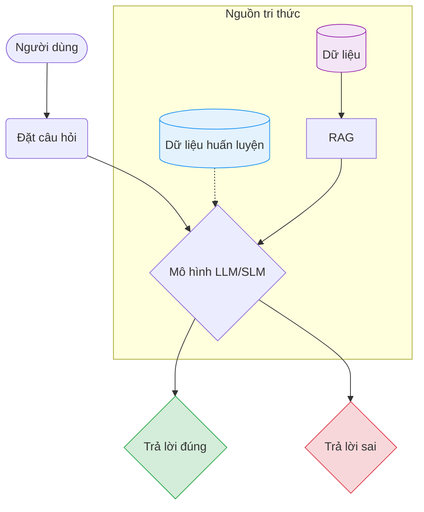
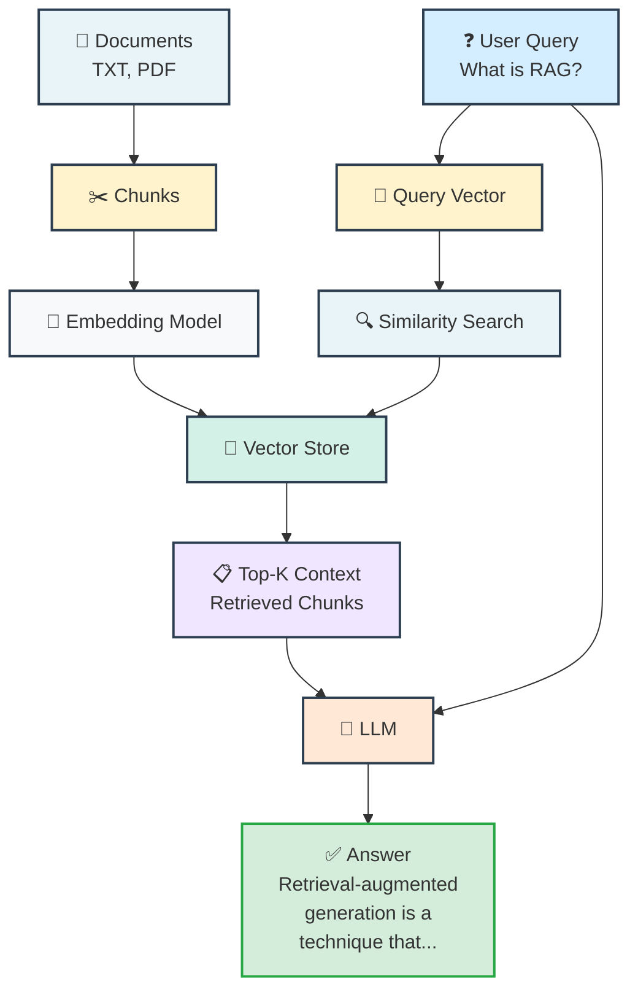
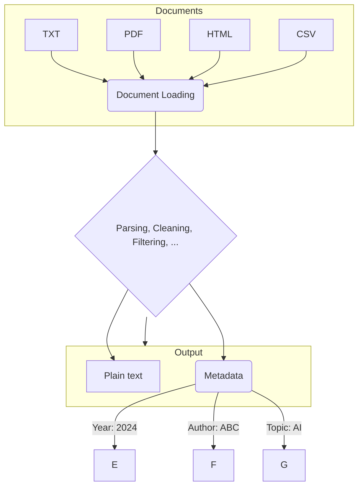

---
title: "RAG-based Question Answering System"
---

# Mục lục

- [[#I. Dẫn nhập|I. Dẫn nhập]]
- [[#II. Cơ sở lý thuyết về RAG|II. Cơ sở lý thuyết về RAG]]
    - [[#II.1. Sự chuyển dịch sang In-Context RAG|II.1. Sự chuyển dịch sang In-Context RAG]]
    - [[#II.2. Kiến trúc RAG hiện đại|II.2. Kiến trúc RAG hiện đại]]
    - [[#II.3. Mở rộng: Phân tích vai trò của các thành phần|II.3. Mở rộng: Phân tích vai trò của các thành phần]]
- [[#III. Thư viện LangChain|III. Thư viện LangChain]]
    - [[#III.1. Giới thiệu|III.1. Giới thiệu]]
    - [[#III.2. Các thành phần cốt lõi|III.2. Các thành phần cốt lõi]]
- [[#IV. Thực hành|IV. Thực hành]]
    - [[#IV.1. Chuẩn bị môi trường và cấu trúc dự án|IV.1. Chuẩn bị môi trường và cấu trúc dự án]]
    - [[#IV.2. Chuẩn bị dữ liệu PDF đầu vào|IV.2. Chuẩn bị dữ liệu PDF đầu vào]]
    - [[#IV.3. Tiền xử lý văn bản và Chunking|IV.3. Tiền xử lý văn bản và Chunking]]
    - [[#IV.4. Xây dựng Vector Database|IV.4. Xây dựng Vector Database]]
    - [[#IV.5. Khởi tạo LLM và xây dựng RAG Chain|IV.5. Khởi tạo LLM và xây dựng RAG Chain]]
    - [[#IV.6. Xây dựng giao diện ứng dụng|IV.6. Xây dựng giao diện ứng dụng]]
- [[#V. Câu hỏi trắc nghiệm|V. Câu hỏi trắc nghiệm]]
- [[#Phụ lục|Phụ lục]]

---

## I. Dẫn nhập
Sự bùng nổ của các **Large Language Models (LLMs)** đã định hình lại NLP, nhưng vẫn tồn tại những hạn chế cố hữu: tri thức bị giới hạn tại thời điểm huấn luyện (Knowledge Cutoff), hiện tượng ảo giác (Hallucination) và thiếu hụt dữ liệu nội bộ riêng tư.

Kỹ thuật **Retrieval-Augmented Generation (RAG)** ra đời nhằm giải quyết vấn đề này bằng cách cho phép LLMs truy cập nguồn tri thức bên ngoài mà không cần fine-tuning tốn kém. Bài viết này sẽ tập trung vào:
1. Phân tích khái niệm và kiến trúc pipeline cơ bản của RAG.
2. Giới thiệu framework **LangChain** - công cụ cốt lõi để xây dựng ứng dụng LLM.
3. Thực hành xây dựng hệ thống **QA System** trên tài liệu PDF học thuật.

## II. Cơ sở lý thuyết về RAG
Khái niệm RAG lần đầu tiên được đề xuất chính thức trong bài báo khoa học "Retrieval Augmented Generation for Knowledge-Intensive NLP Tasks" bởi Patrick Lewis và các cộng sự tại Facebook AI Research (FAIR) vào năm 2020.

**Hình 1:** Tổng quan kiến trúc RAG trong bài báo gốc của Patrick Lewis (2020).

#### Định nghĩa RAG

**RAG (Retrieval-Augmented Generation)** là một mô hình xác suất lai (hybrid probabilistic model) kết hợp hai loại bộ nhớ nhằm khắc phục nhược điểm của các mô hình Pre-trained Seq2Seq truyền thống:

**1. Bộ nhớ tham số (Parametric Memory)**
- Là tri thức ẩn được lưu trữ trong trọng số của mô hình sinh chuỗi (Pre-trained Seq2Seq Transformer).
- Trong bài báo gốc, tác giả sử dụng **BART** (Bidirectional and Auto-Regressive Transformers) làm Generator.

**2. Bộ nhớ phi tham số (Non-Parametric Memory)**
- Là tri thức tường minh từ bên ngoài (external knowledge).
- Cụ thể: một dense vector index chứa các đoạn văn bản Wikipedia.
- Được truy cập thông qua **Neural Retriever** dựa trên kiến trúc **Dense Passage Retriever (DPR)**.

#### Cơ chế hoạt động

Cơ chế hoạt động của RAG gốc cho phép:
- **Generator (BART)** sử dụng đầu vào kết hợp với các tài liệu ẩn (latent documents) tìm được từ **Retriever** để sinh văn bản.
- Toàn bộ kiến trúc được **fine-tuning end-to-end**, cho phép cập nhật trọng số của cả **Query Encoder** và **Generator** để tối ưu hóa tác vụ đích.

Xem chi tiết tại: https://arxiv.org/abs/2005.11401

### II.1. Sự chuyển dịch sang In-Context RAG
Mặc dù tên gọi RAG vẫn giữ nguyên, cách triển khai kỹ thuật này đã thay đổi đáng kể:

*   **RAG Gốc (2020):** Tập trung vào fine-tuning, huấn luyện đồng thời cả bộ truy xuất và mô hình sinh văn bản để chúng học cách phối hợp. Trọng số của mô hình thay đổi.
*   **RAG Hiện đại:** Dựa trên In-Context Learning với các LLM lớn. Thay vì fine-tuning, RAG hiện đại tập trung vào việc "Retrieve and Prompt" (truy xuất và nhắc). Trọng số của LLM được giữ nguyên, chỉ tối ưu hóa việc truy xuất dữ liệu và đưa dữ liệu này vào prompt để LLM xử lý. Cách tiếp cận này linh hoạt, chi phí thấp và dễ áp dụng cho dữ liệu riêng tư.

### II.2. Kiến trúc RAG hiện đại
Một hệ thống RAG tiêu chuẩn hiện nay thường được mô hình hóa thành một quy trình gồm 3
giai đoạn chính: Indexing, Retrieval và Generation.

**Giai đoạn 1: Indexing LLM**

Giai đoạn này tương tự như quy trình ETL (Extract-Transform-Load) trong kỹ thuật dữ liệu, với mục tiêu chuyển đổi dữ liệu thô từ nhiều định dạng khác nhau thành một định dạng thống nhất có thể tìm kiếm được.

1.  **Document Loading (Tải tài liệu):**
    *   Bắt đầu bằng việc thu thập dữ liệu từ nhiều nguồn khác nhau (có sẵn nội bộ hoặc cào từ internet) như TXT, PDF, HTML, CSV.
    *   **Trích xuất nội dung:** Hệ thống xử lý các loại tệp tin đa dạng để loại bỏ định dạng phức tạp (font chữ, màu sắc, layout) và giữ lại **văn bản thuần túy**.
    *   **Thu thập siêu dữ liệu (Metadata):** Ngoài nội dung văn bản, hệ thống còn trích xuất các thông tin ngữ cảnh đi kèm tài liệu, ví dụ: chủ đề, số trang, ngày xuất bản, tác giả, v.v. Metadata đóng vai trò quan trọng trong **Pre-filtering** (lọc trước) để cải thiện hiệu quả tìm kiếm (ví dụ: lọc tài liệu theo năm xuất bản khi người dùng hỏi về "Doanh thu năm 2024").

Đây là sơ đồ trực quan của quy trình đó:

### II.3. Mở rộng: Phân tích vai trò của các thành phần
Vai trò của Vector DB, Embedding Model và Re-ranker.

## III. Thư viện LangChain
Giới thiệu hệ sinh thái LangChain.

### III.1. Giới thiệu
Lý do chọn LangChain cho dự án.

### III.2. Các thành phần cốt lõi
Prompt Templates, Chains, và Memory.

## IV. Thực hành
Hướng dẫn chi tiết các bước triển khai code.

### IV.1. Chuẩn bị môi trường và cấu trúc dự án
Cài đặt thư viện: `langchain`, `chromadb`, `openai`, `pypdf`.

### IV.2. Chuẩn bị dữ liệu PDF đầu vào
Cách thu thập và tổ chức folder dữ liệu.

### IV.3. Tiền xử lý văn bản và Chunking
Kỹ thuật RecursiveCharacterTextSplitter để giữ ngữ cảnh.

### IV.4. Xây dựng Vector Database
Sử dụng ChromaDB để lưu trữ vector embeddings.`

### IV.5. Khởi tạo LLM và xây dựng RAG Chain
Kết nối Retriever với LLM qua LangChain LCEL.

### IV.6. Xây dựng giao diện ứng dụng
Triển khai giao diện Chat sử dụng Streamlit hoặc Chainlit.

## V. Câu hỏi trắc nghiệm
Tổng hợp các câu hỏi để ôn tập kiến thức về RAG.

## Phụ lục
Tài liệu tham khảo và mã nguồn bổ sung.

